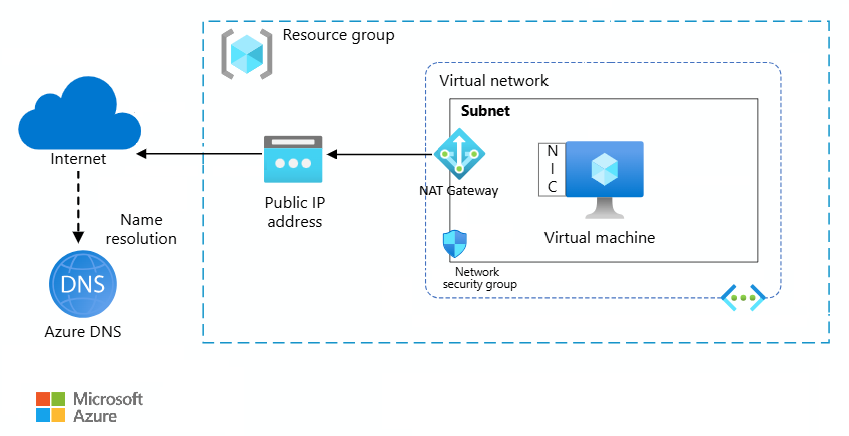
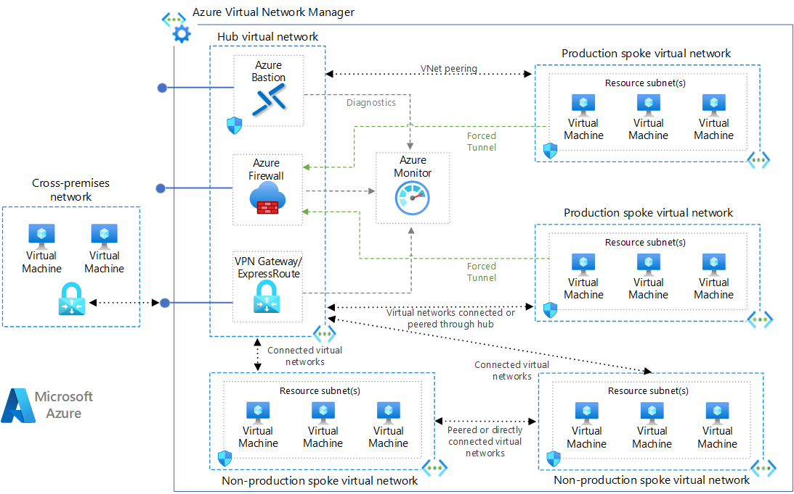
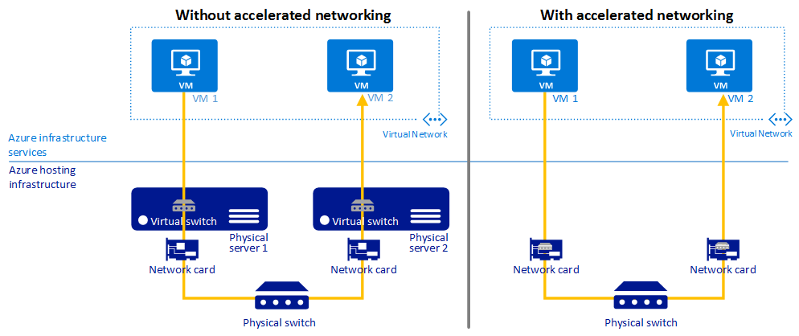
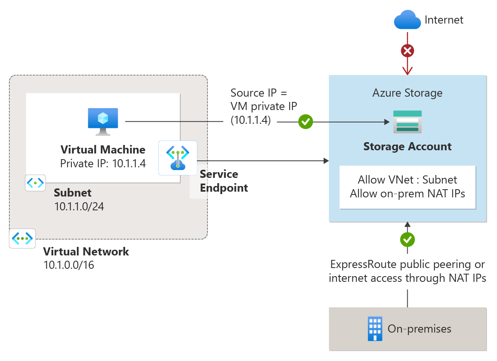
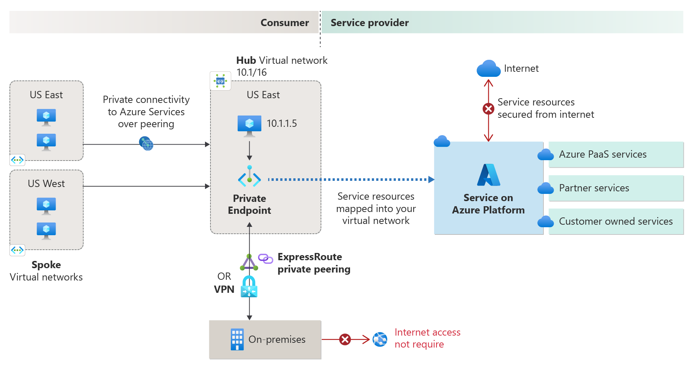
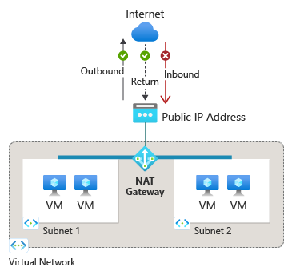
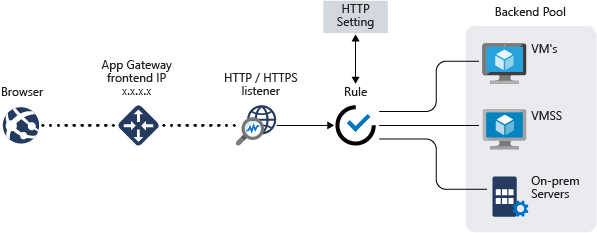

# [Azure networking services overview](https://learn.microsoft.com/en-us/azure/networking/fundamentals/networking-overview)

## [Architecture best practices for Azure Virtual Network](https://learn.microsoft.com/en-us/azure/well-architected/service-guides/virtual-network)

## [Hub-spoke network topology in Azure](https://learn.microsoft.com/en-us/azure/architecture/networking/architecture/hub-spoke)

## [Virtual Network](https://learn.microsoft.com/en-us/azure/virtual-network/)
1. All resources in a virtual network can communicate outbound with the internet, by default.
2. To manage [**outbound connections**](https://learn.microsoft.com/en-us/azure/load-balancer/load-balancer-outbound-connections) use a [**public IP address**](https://learn.microsoft.com/en-us/azure/virtual-network/ip-services/virtual-network-public-ip-address), [**NAT gateway**](https://learn.microsoft.com/en-us/azure/nat-gateway/nat-overview), or [**public load balancer**](https://learn.microsoft.com/en-us/azure/load-balancer/load-balancer-overview).
3. With only [**internal standard load balancer**](https://learn.microsoft.com/en-us/azure/load-balancer/load-balancer-overview), outbound connectivity isn't available
4. To move a virtual machine from one virtual network to another, you must delete and recreate the virtual machine in the new virtual network.
5. [**Virtual network service endpoints**](https://learn.microsoft.com/en-us/azure/virtual-network/virtual-network-service-endpoints-overview) allow you to secure your critical Azure service resources to only a virtual network.
6. [**Virtual network peering**](https://learn.microsoft.com/en-us/azure/virtual-network/virtual-network-peering-overview) connect virtual networks to each other that can be in the same, or different, Azure regions.
7. Communicate with on-premises resources
   - [**Point-to-site VPN**](https://learn.microsoft.com/en-us/azure/vpn-gateway/point-to-site-about?toc=/azure/virtual-network/toc.json#): create a secure connection to your virtual network from an individual client computer.	
   - [**Site-to-site VPN**](https://learn.microsoft.com/en-us/azure/vpn-gateway/design?toc=/azure/virtual-network/toc.json#s2smulti): The communication between your on-premises VPN device and an Azure VPN gateway is sent through an encrypted tunnel over the internet.
   - [**Azure ExpressRoute**](https://learn.microsoft.com/en-us/azure/expressroute/expressroute-introduction?toc=/azure/virtual-network/toc.json): ExpressRoute is an Azure service that lets you create private connections between Microsoft datacenters and infrastructure that's on your premises. This connection is private. Traffic doesn't go over the internet.
8. Filter network traffic between subnets
   - [**Network security groups**](https://learn.microsoft.com/en-us/azure/virtual-network/network-security-groups-overview) and [**Application security groups**](https://learn.microsoft.com/en-us/azure/virtual-network/application-security-groups): Contain multiple inbound and outbound security rules that enable you to filter traffic to and from resources by source and destination IP address, port, and protocol.
   - **Network virtual appliances**: is a virtual machine that performs a network function, such as a firewall or WAN optimization.
9. Route network traffic
   - By default, Azure routes traffic between subnets, connected virtual networks, on-premises networks, and the internet.
   - **Route tables**: [custom route tables](https://learn.microsoft.com/en-us/azure/virtual-network/virtual-networks-udr-overview#user-defined) that control where traffic is routed to for each subnet.
   - **Border gateway protocol (BGP) routes**: Can propagate your on-premises BGP routes to your virtual networks, if you connect your virtual network to your on-premises network by using an Azure VPN gateway or an ExpressRoute connection.
10. Integrate with Azure services
    - **Dedicated service deployment**: [Deploy dedicated instances of the service into a virtual network](https://learn.microsoft.com/en-us/azure/virtual-network/virtual-network-for-azure-services) to enable private access within the virtual network and from on-premises networks. This deployment method provides complete control over network traffic and routing.
    - [**Azure Private Link**](https://learn.microsoft.com/en-us/azure/private-link/private-link-overview) to privately access a specific instance of the service from your virtual network and from on-premises networks.
    - [**Service endpoints**](https://learn.microsoft.com/en-us/azure/virtual-network/virtual-network-service-endpoints-overview): provide secure and direct connectivity to Azure services over an optimized route through the Azure backbone network. It enabling private IP addresses to reach Azure services without requiring public IP addresses.
11. [**Networking limits**](https://learn.microsoft.com/en-us/azure/azure-resource-manager/management/azure-subscription-service-limits#azure-networking-limits)

## Virtual Network concepts
1. **Address space:** a custom private IP address space using public and private addresses.
2. A **subnet** (short for subnetwork) is a logical, visible division of an IP network. 🌐 Essentially, it's a network within a network. Secure resources within subnets using Network Security Groups.
3. [**Azure network security**](https://learn.microsoft.com/en-us/azure/security/fundamentals/network-overview).

## [FAQ](https://learn.microsoft.com/en-us/azure/virtual-network/virtual-networks-faq)
1. You can link a virtual network to other virtual networks and on-premises networks as long as the CIDR blocks don't overlap.
2. Configuration
   - What tools do I use to create a virtual network? - Azure portal, Powershell, Azure CLI and [Network configuration file](https://learn.microsoft.com/en-us/previous-versions/azure/virtual-network/virtual-networks-using-network-configuration-file) (netcfg, for classic virtual networks only)
   - What address ranges can I use in my virtual networks?
     1. We recommend that you use the following address ranges. The IETF has set aside these ranges for private, non-routable address spaces.
        - 10.0.0.0 to 10.255.255.255 (10/8 prefix)
        - 172.16.0.0 to 172.31.255.255 (172.16/12 prefix)
        - 192.168.0.0 to 192.168.255.255 (192.168/16 prefix)
     2. Can also deploy the shared address space reserved in RFC 6598, which is treated as a private IP address space in Azure: 100.64.0.0 to 100.127.255.255 (100.64/10 prefix)
     3. can't add the following address ranges: 224.0.0.0/4 (multicast), 255.255.255.255/32 (broadcast), 127.0.0.0/8 (loopback), 169.254.0.0/16 (link local), 168.63.129.16/32 (internal DNS).
   - **Azure reserves the first four addresses and the last address, for a total of five IP addresses within each subnet.**
     - For example, the IP address range of 192.168.1.0/24 has the following reserved addresses:
       1. 192.168.1.0: Network address.
       2. 192.168.1.1: Reserved by Azure for the default gateway.
       3. 192.168.1.2, 192.168.1.3: Reserved by Azure to map the Azure DNS IP addresses to the virtual network space.
       4. 192.168.1.255: Network broadcast address.
   - The smallest supported IPv4 subnet is /29, and the largest is /2 (using CIDR subnet definitions). IPv6 subnets must be exactly /64 in size.
   - When you apply NSGs at both a network adapter (NIC) and a subnet for a VM:
     - A subnet-level NSG, followed by a NIC-level NSG, is processed for inbound traffic.
     - A NIC-level NSG, followed by a subnet-level NSG, is processed for outbound traffic.
   - virtual networks are not supported to **Multicast (One-to-Many Selective)** and **Broadcast (One-to-All)**.
   - Use TCP, UDP, ESP, AH, and ICMP TCP/IP protocols in virtual networks. You can't use Dynamic Host Configuration Protocol (DHCP) via Unicast (source port UDP/68, destination port UDP/67). UDP ports 4791 and 65330 are reserved for the host.
   - Azure-provided default gateway doesn't respond to a ping.
   - If you want to connect inbound to a resource deployed through Azure Resource Manager, the resource must have a public IP address assigned to it
   - Every cloud service deployed in Azure has a publicly addressable virtual IP (VIP) assigned to it. You define input endpoints for platform as a service (PaaS) roles and endpoints for virtual machines to enable these services to accept connections from the internet.
   - A virtual network is limited to a single region. But a virtual network does span availability zones. You can connect virtual networks in different regions by using virtual network peering.
   - Connect one virtual network to another virtual network by using either: Virtual network peering Or Azure VPN gateway ([Configure a network-to-network VPN gateway connection](https://learn.microsoft.com/en-us/azure/vpn-gateway/vpn-gateway-howto-vnet-vnet-resource-manager-portal?toc=/azure/virtual-network/toc.json))
3. Name resolution (DNS)
   1. Azure-provided DNS is a multitenant DNS service from Microsoft. Azure registers all of your VMs and cloud service role instances in this service.
   2. Can't specify a custom DNS suffix for your virtual networks.
4. Connecting virtual machines
   1. Resources deployed through the classic deployment model are assigned private IP addresses, even if they're not connected to a virtual network.
   2. You can't reserve a private IP address. 
   3. Yes, move VMs from one subnet to another subnet in a virtual network without redeploying. 
   4. VM retains the MAC address when it's in the deallocated state. The MAC address remains assigned to the network adapter.
5. Azure services that connect to virtual networks
   1. Resources deployed through some Azure PaaS services (such as Azure Storage and Azure SQL Database) can restrict network access to virtual networks through the use of virtual network service endpoints or Azure Private Link.
   2. Can't move services in and out of virtual networks. To move a resource to another virtual network, you have to delete and redeploy the resource.
6. Security
   1. Apply network security groups to individual subnets within a virtual network, NICs attached to a virtual network, or both for restricting inbound or outbound traffic flow to resources that are connected to a virtual network.
7. Virtual network peering
   1.  A peering connection between virtual networks enables you to route traffic between them privately through IPv4 addresses. Virtual machines in peered virtual networks can communicate with each other as if they're within the same network. These virtual networks can be in the same region or in different regions (also known as global virtual network peering). You can also create virtual network peering connections across Azure subscriptions.
   2. Global virtual network peering enables you to peer virtual networks in different regions. 
   3. But you can't connect to resources that are behind a basic load balancer through the front-end IP of the load balancer over global virtual network peering. This restriction doesn't exist for a standard load balancer. Can connect to these resources via Azure ExpressRoute or network-to-network connections through virtual network gateways.
   4. If your peering connection is in an Initiated state, you created only one link. You must create a bidirectional link to establish a successful connection.
   5. Can't move a virtual network that has a peering connection to another virtual network. You must delete the peering connection before moving the virtual network.
   6. Virtual network peering connections go into a Disconnected state when one virtual network peering link is deleted. You must delete both links to re-establish a successful peering connection.
8. Virtual network service endpoints 
   - Not all Azure services reside in the customer's virtual network. Most Azure data services (such as Azure Storage, Azure SQL, and Azure Cosmos DB) are multitenant services that can be accessed over public IP addresses.
   - When you turn on virtual network service endpoints on the network side, and set up appropriate virtual network ACLs on the Azure service side, access to an Azure service is restricted to an allowed virtual network and subnet.
   - All traffic that uses virtual network service endpoints flows over the Microsoft backbone to provide another layer of isolation from the public internet. Service endpoints always take service traffic directly from your virtual network to the service on the Microsoft Azure backbone network. Service endpoints handle only TCP traffic.
   - Virtual network service endpoints help protect Azure service resources. Virtual network resources are protected through network security groups.
   - Yes, virtual network service endpoints and ACLs can be configured across different Microsoft Entra tenants only for Azure Storage and Azure Key Vault; other Azure services do not support cross-tenant service endpoints.
   - To secure Azure services to multiple subnets within a virtual network or across multiple virtual networks, enable service endpoints on the network side on each of the subnets independently. Then, secure Azure service resources to all of the subnets by setting up appropriate virtual network ACLs on the Azure service side.
   - When an Azure service account with a virtual network ACL enabled is accessed from outside the virtual network, the request is denied and the service returns an HTTP 403 or 404 error.
   - Most of the Azure services, virtual networks created in different regions can access Azure services in another region through the virtual network service endpoints. Azure SQL is an exception and is regional in nature.
   - Use virtual network service endpoint policies to filter virtual network traffic to Azure services, allowing only specific Azure service resources over the service endpoints. 
9. Once an Azure public IP address is deleted, it cannot be recovered.

## IMP
1. When you decide [which regions](https://learn.microsoft.com/en-us/azure/virtual-network/virtual-network-vnet-plan-design-arm#regions) in which to deploy resources, consider where consumers of the resources are physically located. Consumers of resources typically want the lowest network latency to their resources.
2. Lowest network latency means data travels between systems with the least possible delay, so communication happens very fast with minimal waiting time.
3. An address range is specified in classless internet domain routing (CIDR) format, such as 10.0.0.0/16.

## [Azure Virtual Network](https://learn.microsoft.com/en-us/azure/virtual-network/quickstart-create-virtual-network?tabs=portal)
1. Azure Virtual Network enables you to create private networks in the cloud, securely connecting Azure resources, the Internet, and on-premises networks.
2. Azure virtual network subnets are essential containers where all Azure resources are deployed within a virtual network.
3. [Add a subnet](https://learn.microsoft.com/en-us/azure/virtual-network/virtual-network-manage-subnet?tabs=azure-portal#add-a-subnet) OR [Change subnet settings](https://learn.microsoft.com/en-us/azure/virtual-network/virtual-network-manage-subnet?tabs=azure-portal#change-subnet-settings)
4. [Create a virtual network and an Azure Bastion host](https://learn.microsoft.com/en-us/azure/virtual-network/quickstart-create-virtual-network)
   1. On the Basics tab of Create virtual network required : (Project details) Subscription, Resource group and (Instance details) Name, Region.
   2. On Security tab, select Enable Azure Bastion: Azure Bastion host name & Azure Bastion public IP address (Ex.Create a public IP address). Other Enable options: Azure Firewall, Azure DDoS Network Protection.
   3. On IP Addresses tab, IPv4 address spaces (specify IP address in CIDR notation) and Azure has pre-populated the address space (10.1.0.0/16).
   4. Select `+ Add subnet` if want to add subnets or in the address space box in Subnets, select the `default` subnet.
   5. In Edit subnet: Subnet purpose, Name, IPv4 (IPv4 address range, Starting address, Size:/24) 
   6. Select Save. Select Review + create. Select Create.
5. The default outbound access IP is disabled when one of the following events happens:
   - A public IP address is assigned to the VM.
   - The VM is placed in the backend pool of a standard load balancer, with or without outbound rules.
   - An Azure NAT Gateway resource is assigned to the subnet of the VM.
6. Azure Monitor currently doesn't support analyzing Azure virtual network metrics from the metrics explorer. To view Azure virtual network metrics, select Metrics under Monitoring from the virtual network you want to analyze.

## [Azure virtual network traffic routing](https://learn.microsoft.com/en-us/azure/virtual-network/virtual-networks-udr-overview)
1. Azure automatically creates a route table for each subnet within an Azure virtual network and adds system default routes to the table.
2. Azure automatically creates system routes and assigns the routes to each subnet in a virtual network. You can't create system routes, and you can't remove system routes, but you can override some system routes with custom routes.
   - Each route includes an [address prefix and next hop type](https://learn.microsoft.com/en-us/azure/virtual-network/virtual-networks-udr-overview#default-system-routes). 
   - next hop types: 
     - Virtual network: Routes traffic between address ranges within the address space of a virtual network. By default, Azure routes traffic between subnets. Azure doesn't create default routes for subnet address ranges.
     - If you don't override the Azure default routes, Azure routes traffic for any address not specified by an address range within a virtual network to the internet. The exception is that traffic to the public IP addresses of Azure services remains on the Azure backbone network and isn't routed to the internet.
     -  Traffic routed to the None next hop type is dropped rather than routed outside the subnet. Azure creates system default routes for reserved address prefixes with None as the next hop type.(10.0.0.0/8, 172.16.0.0/12, and 192.168.0.0/16 also 100.64.0.0/10)
3. Azure creates more default system routes for different Azure capabilities, but only if you enable the capabilities(Virtual network peering, Virtual network gateway, VirtualNetworkServiceEndpoint).
4. By default, a route table can contain up to 400 UDRs (user-defined (static) routes).  If there are conflicting route assignments, UDRs override the default routes.
5. Specify a service tag as the address prefix for a UDR instead of an explicit IP range. Can currently create 25 or fewer routes with service tags in each route table.
6. Disable ExpressRoute and Azure VPN Gateway route propagation on a subnet by using a property (disable route propagation) on a route table. Route propagation shouldn't be disabled on GatewaySubnet. If this setting is disabled, the gateway doesn't function.
7. [How Azure selects routes for traffic routing](https://learn.microsoft.com/en-us/azure/virtual-network/virtual-networks-udr-overview#how-azure-selects-routes-for-traffic-routing)
   - When outbound traffic is sent from a subnet, Azure selects a route based on the destination IP address by using the longest prefix match algorithm.
   - If multiple routes contain the same address prefix, Azure selects the route type based on the following priority: User-defined route, BGP route & System route. UDRs are a higher priority than system default routes, see [Routing example](https://learn.microsoft.com/en-us/azure/virtual-network/virtual-networks-udr-overview#routing-example).

## [Azure Accelerated Networking](https://learn.microsoft.com/en-us/azure/virtual-network/accelerated-networking-overview?tabs=redhat#supported-vm-instances)
1. Azure Accelerated Networking significantly improves virtual machine networking performance by reducing latency and CPU utilization.

2. The virtual switch provides all policy enforcement to network traffic. The network interface (NIC) bypasses the host and the virtual switch, while it maintains all the policies that it applied in the host.
3. Enable Accelerated Networking on a supported VM only when the VM is stopped and deallocated.
4. User-defined routes with next hop Virtual Network Gateway are supported only when the Virtual Network's gateway is a VPN gateway

## [Network Interface](https://learn.microsoft.com/en-us/azure/virtual-network/virtual-network-network-interface)
1. A network interface (NIC) enables an Azure virtual machine (VM) to communicate with internet, Azure, and on-premises resources.
2. Any network interface attached to a virtual machine that forwards network traffic to an address other than its own must have the Azure Enable IP forwarding option enabled for it. The setting disables the check of the source and destination for a network interface by Azure.

## [Application security groups](https://learn.microsoft.com/en-us/azure/virtual-network/application-security-groups)
1. Application Security Group (ASG), is a networking feature that allows you to group Azure virtual machines (VMs) based on the application to which they belong. Allowing you to group virtual machines and define network security policies based on those groups.
2. An Azure Application Security Group (ASG) logically groups virtual machines (VMs) by application function (like "web tier" or "database tier") to simplify network security, letting you define Network Security Group (NSG) rules based on these groups instead of individual IP addresses, making policies scalable, reusable, and easier to manage as your application changes.
3. inbound traffic from the internet is denied by the **DenyAllInbound** default security rule. **AllowVNetInBound** default security rule allows all communication between resources in the same virtual network.
4. Network interfaces (NIC) that are members of the application security group apply the network security group rules that specify it as the source or destination. If the network interface isn't a member of an application security group, the rule doesn't apply to the network interface, even though the network security group is associated to the subnet.
5. Can't add network interfaces (NIC) from different virtual networks to the same application security group. All network interfaces for both the source and destination application security groups must exist in the same virtual network.

## [Azure network security groups]()
1. An Azure Network Security Group (NSG) is used to allow or deny inbound and outbound network traffic between Azure resources within a virtual network using [security rules](https://learn.microsoft.com/en-us/azure/virtual-network/network-security-groups-overview#security-rules).
2. Filter network traffic to and from Azure resources in an Azure virtual network with a network security group.
3. Security rules
   - Each rule specifies the following properties: Name, Priority (100 and 4096), Source or destination, Protocol (TCP, UDP, ICMP), Direction (inbound or outbound traffic), Port range, Action (Allow or deny)
   - **Priority**
     - Lower numbers processed before higher numbers because **lower numbers have higher priority**.
     - Azure default security rules are given the lowest priority (highest number) to ensure your custom rules are always processed first.
   - Source or destination:  Individual IP address, a CIDR block (for example, 10.0.0.0/24), a service tag, or an application security group. To specify a particular Azure resource, use the private IP address assigned to the resource.
   - Port range: Specifying ranges and comma separation empowers you to create fewer security rules
4. Security rules are evaluated and applied based on the five-tuple information of source, source port, destination, destination port, and protocol. If inbound traffic is allowed over a port, it's not necessary to specify an outbound security rule to respond to traffic over the port.
5. [Default security rules](https://learn.microsoft.com/en-us/azure/virtual-network/network-security-groups-overview#default-security-rules)
   - Inbound: **AllowVNetInBound**, **AllowAzureLoadBalancerInBound**, **DenyAllInbound**
   - Outbound: **AllowVnetOutBound**, **AllowInternetOutBound**, **DenyAllOutBound**
   - You can't remove the default rules, but you can override them by creating rules with higher priorities.
6. [Security admin rules](https://learn.microsoft.com/en-us/azure/virtual-network-manager/concept-security-admins) are global network security rules that enforce security policies onto virtual networks. Security admin rules always have a higher priority than network security group rules. 
7. Flow timeout settings determine how long a flow record remains active before expiring. If you need to send email from your virtual machine, you have to use an SMTP relay service.

## [Service endpoints]()
1. Azure virtual network service endpoints enable secure, direct access to Azure services over the Azure backbone network, allowing private IPs in a virtual network to reach Azure services without using public IP addresses.

2. With service endpoints, service traffic switches to use virtual network private addresses as the source IP addresses when accessing the Azure service from a virtual network.
3. To inspect or filter traffic from a virtual network to an Azure service, you can deploy a network virtual appliance (NVA) within the virtual network.

## [Service tag](https://learn.microsoft.com/en-us/azure/virtual-network/service-tags-overview)
1. A service tag represents a group of IP address prefixes from a given Azure service. 
2. **How it works**: When you specify a service tag name (such as ApiManagement) in the appropriate source or destination field of a security rule, you allow or deny the traffic for the corresponding service. The service tag automatically includes all current and future IP address ranges used by that service. 
3. Service tag `Storage` represents Azure Storage for the entire cloud, but `Storage.WestUS` narrows the range to only the storage IP address ranges from the WestUS region. Enabling granular control over network traffic to and from Azure services.
4. When using service tags with Azure Firewall, you can only create destination rules on inbound and outbound traffic. Source rules aren't supported.

## [Azure Private Link](https://learn.microsoft.com/en-us/azure/private-link/private-link-overview)
1. Azure Private Link enables you to access Azure PaaS Services (for example, Azure Storage and SQL Database) and Azure hosted customer-owned/partner services over a private endpoint in your virtual network.

2. Traffic between your virtual network and the service travels through the Microsoft backbone network. Exposing your service to the public internet is no longer necessary.
3. A [private endpoint](https://learn.microsoft.com/en-us/azure/private-link/private-endpoint-overview) is a network interface that uses a private IP address from your virtual network. This network interface connects you privately and securely to a service that's powered by Azure Private Link. Private endpoints allow ingress of traffic from your virtual network to an Azure resource securely.
4. [Azure Private Link service](https://learn.microsoft.com/en-us/azure/private-link/private-link-service-overview) is the reference to your own service that is powered by Azure Private Link.

## [Azure DNS (Domain Name System)](https://learn.microsoft.com/en-us/azure/dns/)
1. Azure DNS provides DNS hosting and resolution using the Microsoft Azure infrastructure.
2. Azure DNS consists of three services:
   1. [Azure Public DNS](https://learn.microsoft.com/en-us/azure/dns/public-dns-overview) is a hosting service for DNS domains. You can't use Azure Public DNS to buy a domain name.
   2. [Azure Private DNS](https://learn.microsoft.com/en-us/azure/dns/private-dns-overview) is a DNS service for your virtual networks. Azure Private DNS manages and resolves domain names in the virtual network without the need to configure a custom DNS solution.
   3. [Azure DNS Private Resolver](https://learn.microsoft.com/en-us/azure/dns/dns-private-resolver-overview) is a service that enables you to query Azure DNS private zones from an on-premises environment and vice versa without deploying VM based DNS servers.
   4. [Azure Traffic Manager](https://learn.microsoft.com/en-us/azure/traffic-manager/traffic-manager-overview) is a DNS-based traffic load balancer. This service allows you to distribute traffic to your public facing applications across the global Azure regions. **Traffic Manager works at the DNS level which is at the Application layer (Layer-7).** [How Traffic Manager works](https://learn.microsoft.com/en-us/azure/traffic-manager/traffic-manager-how-it-works)
   5. [DNS Security Policy](https://learn.microsoft.com/en-us/azure/dns/dns-security-policy) offers the ability to filter and log DNS queries at the virtual network level. It also includes a Threat Intelligence feed which allows early detection and prevention of security incidents on your Virtual Networks where known malicious domains sourced by [Microsoft's Security Response Center (MSRC)](https://www.microsoft.com/msrc) can be blocked from name resolution.
3. Azure DNS also provides internal DNS resolution for both private and public (internet) resources from within virtual networks. By default, virtual networks are configured to resolve DNS records using Azure-provided DNS at [168.63.129.16](https://learn.microsoft.com/en-us/azure/virtual-network/what-is-ip-address-168-63-129-16).
4. To resolve the private-linked storage account from on-premises, or to resolve on-premises resources from within Azure, you can configure a **DNS private resolver**.

## [Azure Bastion](https://learn.microsoft.com/en-us/azure/bastion/bastion-overview)
1. Azure Bastion is a fully managed PaaS service that you provision to securely connect to virtual machines via private IP address. Bastion provides secure RDP and SSH connectivity to all of the VMs in the virtual network for which it's provisioned.
2. Azure Bastion is a service that you can deploy in a virtual network to allow you to connect to a virtual machine using your browser and the Azure portal. You can also connect using the native SSH or RDP client already installed on your local computer.

## [Azure Route Server](https://learn.microsoft.com/en-us/azure/route-server/overview)
1. Azure Route Server simplifies dynamic routing between your network virtual appliance (NVA) and your virtual network.
2. It enables automatic route exchange through Border Gateway Protocol (BGP) between NVAs and the Azure Software Defined Network (SDN), eliminating the need for manual route table configuration and maintenance.

## [NAT Gateway](https://learn.microsoft.com/en-us/azure/nat-gateway/nat-overview)
1. NAT Gateway simplifies outbound-only Internet connectivity for virtual networks.
2. Use Azure NAT (Network Address Translation) Gateway to let all instances in a subnet connect outbound to the internet while remaining fully private.

3. Azure NAT Gateway is available in two SKUs:
   1. Standard SKU NAT Gateway is zonal (deployed to a single availability zone) and provides scalable outbound connectivity for subnets in a single virtual network.
   2. StandardV2 SKU NAT Gateway is zone-redundant with higher throughput than the Standard SKU, IPv6 support, and flow log support.

## [Azure Load Balancer](https://learn.microsoft.com/en-us/azure/load-balancer/load-balancer-overview)
1. Load balancing refers to efficiently distributing incoming network traffic across a group of backend virtual machines (VMs) or virtual machine scale sets (VMSS).
2. Azure Load Balancer provides high-performance, low-latency Layer 4 load-balancing (Open Systems Interconnection (OSI) model) for all UDP and TCP protocols. It manages inbound and outbound connections.
3. You can configure public and internal load-balanced endpoints. You can define rules to map inbound connections to back-end pool destinations by using TCP and HTTP health-probing options to manage service availability.

## [Azure Application Gateway](https://learn.microsoft.com/en-us/azure/application-gateway/overview)
1. Azure Application Gateway is a web traffic load balancer that helps you manage traffic to your web applications.
2. Application Gateway makes intelligent routing decisions based on HTTP request attributes like URL paths and host headers.
3. It's an Application Delivery Controller (ADC) as a service, offering various layer 7 load-balancing capabilities for your applications. Diagram shows url path-based routing with Application Gateway.

## [Azure Front Door](https://learn.microsoft.com/en-us/azure/frontdoor/front-door-overview)
1. [Azure Front Door](https://youtu.be/-4FQYxV9mAE) is Microsoft's advanced cloud Content Delivery Network (CDN) designed to provide fast, reliable, and secure access to your applications' static and dynamic web content globally.

## [VPN Gateway](https://learn.microsoft.com/en-us/azure/vpn-gateway/vpn-gateway-about-vpngateways)
1. Azure VPN Gateway service can be used to send encrypted traffic between an Azure virtual network and on-premises locations over the public Internet. 
2. VPN Gateway helps you create encrypted cross-premises connections to your virtual network from on-premises locations, or create encrypted connections between VNets.
3. [VPN Gateway topology and design](https://learn.microsoft.com/en-us/azure/vpn-gateway/design)
   1. Site-to-site VPN connectivity: used for cross-premises and [hybrid configurations](https://learn.microsoft.com/en-us/azure/networking/hybrid-connectivity/hybrid-connectivity?toc=%2Fazure%2Fvpn-gateway%2Ftoc.json).
   2. Point-to-site VPN connectivity: create a secure connection to your virtual network from an individual client computer.
   3. VNet-to-VNet VPN connectivity
4. If you connect a virtual network to an on-premises network by using an Azure VPN gateway, the virtual network must have a dedicated subnet for the gateway.

## [ExpressRoute](https://learn.microsoft.com/en-us/azure/expressroute/expressroute-introduction)
1. ExpressRoute lets you extend your on-premises networks into the Microsoft cloud over a private connection with the help of a connectivity provider. This connection is private. Traffic doesn't go over the internet (Layer 3 connectivity). [ExpressRoute cheat sheet](https://download.microsoft.com/download/b/9/2/b92e3598-6e2e-4327-a87f-8dc210abca6c/AzureNetworking-ExRCheatSheet-v1-2.pdf)

## [Azure Virtual WAN](https://learn.microsoft.com/en-us/azure/virtual-wan/virtual-wan-about)
1. Azure Virtual WAN is a networking service that brings many networking, security, and routing functionalities together to provide a single operational interface.

# Network security
Networking services in Azure that protects and monitor your network resources - Firewall Manager, Firewall, Web Application Firewall, and DDoS Protection.

## [Azure Firewall Manager](https://learn.microsoft.com/en-us/azure/firewall-manager/overview)
1. Azure Firewall Manager is a security management service that provides central security policy and route management for cloud-based security perimeters.
2. With Azure Firewall Manager, you can deploy multiple Azure Firewall instances across Azure regions and subscriptions, implement DDoS protection plans, manage web application firewall policies, and integrate with partner security-as-a-service for enhanced security.

## [Azure Firewall](https://learn.microsoft.com/en-us/azure/firewall/overview)
1. Azure Firewall is a managed, cloud-based network security service that protects your Azure Virtual Network resources (Azure cloud workloads). It provides both network and application-level security for your Azure workloads. 
2. Azure Firewall is available in three SKUs: Basic (for **small and medium-sized businesses** (SMBs)), Standard, and Premium.

## [Azure Web Application Firewall](https://learn.microsoft.com/en-us/azure/web-application-firewall/overview)
1. Azure Web Application Firewall provides centralized protection of your web applications from common exploits and vulnerabilities.
2. Azure Web Application Firewall (WAF) provides protection to your web applications from common web exploits and vulnerabilities such as SQL injection, and cross site scripting.
3. Azure Web Application Firewall can be deployed with these Microsoft services: Azure Application Gateway, Azure Application Gateway for Containers, Azure Front Door, Azure Content Delivery Network

## [DDoS Protection](https://learn.microsoft.com/en-us/azure/ddos-protection/ddos-protection-overview)
1. Distributed denial of service (DDoS) attacks
2. Azure DDoS Protection provides countermeasures against the most sophisticated DDoS threats. The service provides enhanced DDoS mitigation capabilities for your application and resources deployed in your virtual networks.
3. Azure DDoS Protection protects at layer 3 and layer 4 network layers. For web applications protection at layer 7.
4. Azure DDoS Protection consists of two tiers:
   1. [DDoS Network Protection](https://learn.microsoft.com/en-us/azure/ddos-protection/manage-ddos-protection)
   2. [DDoS IP Protection](https://learn.microsoft.com/en-us/azure/ddos-protection/manage-ddos-protection)

# Network Management and monitoring
Network management and monitoring services in Azure - Network Watcher, Azure Monitor, and Azure Virtual Network Manager.

## [Azure Network Watcher](https://learn.microsoft.com/en-us/azure/network-watcher/network-watcher-monitoring-overview?toc=/azure/networking/toc.json)
1. Azure Network Watcher provides a suite of tools to monitor, diagnose, view metrics, and enable or disable logs for Azure IaaS (Infrastructure-as-a-Service) resources.

## [Azure Monitor](https://learn.microsoft.com/en-us/azure/azure-monitor/fundamentals/overview)
1. Azure Monitor is a comprehensive monitoring solution for collecting, analyzing, and responding to monitoring data from your cloud and on-premises environments.
2. It helps you understand how your applications are performing and proactively identifies issues affecting them and the resources they depend on.

3. Azure Monitor similarly organizes core monitoring data into metrics and logs based on resource types, also called namespaces. Different metrics and logs are available for different resource types.
4. Azure Monitor collects platform metrics automatically. No configuration is required.
5. [Resource logs](https://learn.microsoft.com/en-us/azure/azure-monitor/platform/resource-logs) provide insight into operations that were done by an Azure resource. Resource logs aren't collected by default. To collect them, you must create a diagnostic setting for each Azure resource.
6. The Azure Monitor [activity log](https://learn.microsoft.com/en-us/azure/azure-monitor/platform/activity-log) is a platform log for control plane events from Azure resources. The activity log contains subscription-level events that track operations for each Azure resource. Activity log events are retained in Azure for 90 days and then deleted.
7. Analyze monitoring data in the Azure Monitor Logs / Log Analytics store by using the Kusto query language (KQL).

## [Azure Virtual Network Manager](https://learn.microsoft.com/en-us/azure/virtual-network-manager/overview)
1. Azure Virtual Network Manager is a centralized management service that enables you to group, configure, deploy, and manage virtual networks globally across subscriptions and tenants.
2. With Virtual Network Manager, you can define network groups to identify and logically segment your virtual networks. Then you can determine the [connectivity](https://learn.microsoft.com/en-us/azure/virtual-network-manager/concept-connectivity-configuration) and [security configurations](https://learn.microsoft.com/en-us/azure/virtual-network-manager/concept-security-admins) you want and apply them across all the selected virtual networks in network groups at once.
3. A [network group]((https://learn.microsoft.com/en-us/azure/virtual-network-manager/concept-network-groups)) is global container that includes a set of virtual network resources from any region.

## Other
1. [Azure Peering Service](https://learn.microsoft.com/en-us/azure/peering-service/about) enhances customer connectivity to Microsoft cloud services such as Microsoft 365, Dynamics 365, software as a service (SaaS) services, Azure, or any Microsoft services accessible via the public internet.
2. A [resource provider](https://learn.microsoft.com/en-us/azure/azure-resource-manager/management/azure-services-resource-providers) is a collection of REST operations that enables functionality for an Azure service.

# Question and Answer

#### Q. What is VNet?
**Answer.** Azure Virtual Network (VNet) is the fundamental building block for your private network in Azure.

#### Q1. If I peer VNetA to VNetB and I peer VNetB to VNetC, does that mean VNetA and VNetC are peered?
**Answer.** No. Transitive peering is not supported. You must manually peer VNetA to VNetC.

#### Q2. What is Azure Resource Manager?
**Answer.** Azure Resource Manager is the latest deployment and management model in Azure that's responsible for creating, managing, and deleting resources in your Azure subscription.

#### Q3. What is Azure network security?
**Answer.** [Network security](https://learn.microsoft.com/en-us/azure/networking/security/network-security?toc=/azure/firewall/toc.json&bc=/azure/firewall/breadcrumb/toc.json) is a critical aspect of cloud computing, as it protects the data and applications that run on the cloud from various threats and attacks. Azure network security is the [Zero Trust model](https://learn.microsoft.com/en-us/security/zero-trust/zero-trust-overview), which assumes that no network or device is inherently secure or trustworthy. 

#### Q. [Azure Virtual Network Manager](https://learn.microsoft.com/en-us/azure/virtual-network-manager/overview)
---
- Connect your on-premises computers and networks to a virtual network using VPN Gateway or ExpressRoute.
- Each network security group contains rules, which allow or deny traffic to and from sources and destinations.
- Filter network traffic to and from resources in a virtual network by using network security groups and network virtual appliances.
- To simplify management of security rules, we recommend that you associate a network security group to individual subnets rather than individual network interfaces within the subnet whenever possible.
- If different VMs within a subnet need different security rules applied to them, you can associate the network interface in the VM to one or more application security groups.
- Azure creates several default routes for outbound traffic from a subnet.
- [peering requirements and constraints](https://learn.microsoft.com/en-us/azure/virtual-network/virtual-network-manage-peering#requirements-and-constraints).
- To resolve names in a peered virtual network, [deploy your own DNS server](https://learn.microsoft.com/en-us/azure/virtual-network/virtual-networks-name-resolution-for-vms-and-role-instances#name-resolution-that-uses-your-own-dns-server) or use Azure DNS [private domains](https://learn.microsoft.com/en-us/azure/dns/private-dns-overview?toc=/azure/virtual-network/toc.json). Resolving names between resources in a virtual network and on-premises networks also requires you to deploy your own DNS server.
- Policies are applied to the following hierarchy: management group, subscription, and resource group.